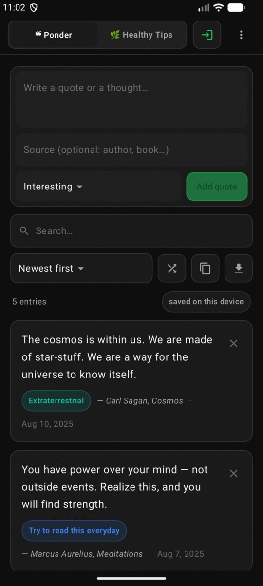
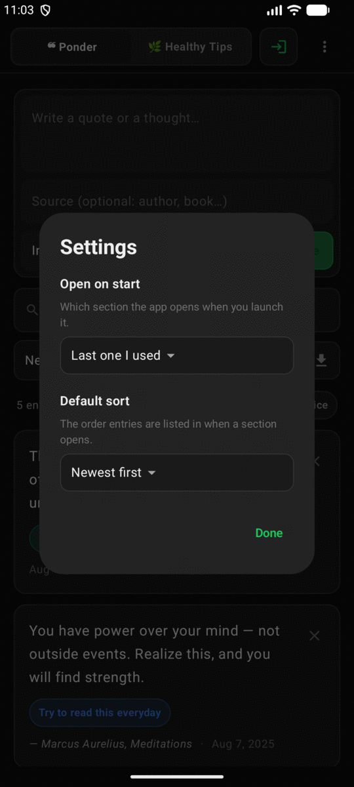
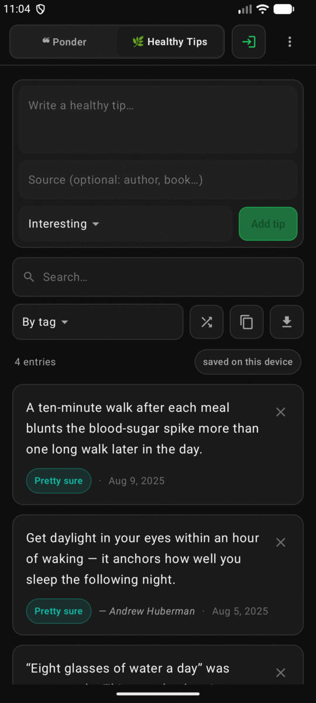
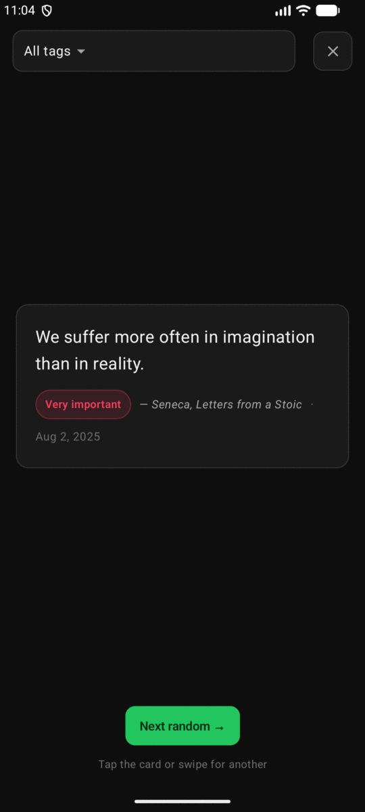
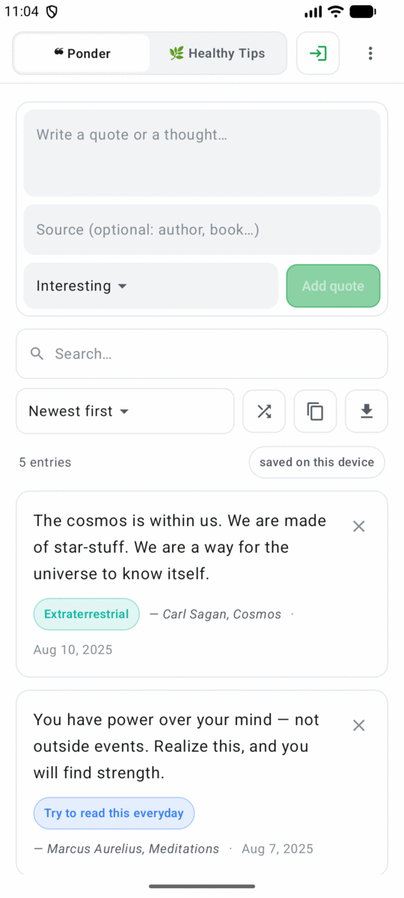
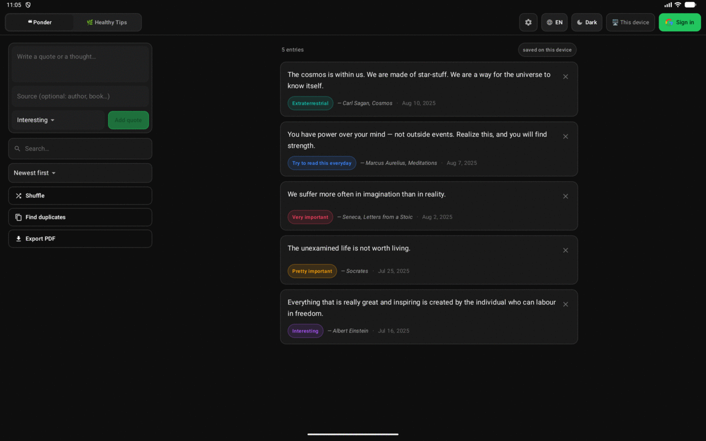

# ❝ Ponder for Android

The Android version of [hanifedma/ponder](https://github.com/hanifedma/ponder) —
a small, fast place to keep your favourite quotes, your own thoughts, and healthy
tips.

It talks to **the same Firestore database as the web app**: the same
`/users/{uid}/quotes` and `/users/{uid}/healthtips` documents, with the same
`text`, `source`, `tag` and `createdAt` fields. Sign in with the same Google
account and everything you added in the browser is already there, and anything
you add on the phone shows up in the browser.

> **It works before any setup.** With no Firebase file in place the app runs in
> device-only mode, exactly like the web app does. To turn on Google sign-in and
> sync, follow **[SETUP.md](SETUP.md)** — a one-time, five-minute registration in
> the Firebase console.

---

## What it looks like

| ❝ Ponder | ⚙️ Settings | 🌿 Opens on Healthy Tips |
|---|---|---|
|  |  |  |

| 🔀 Shuffle | ☀️ Light | 📐 Tablet |
|---|---|---|
|  |  |  |

---

## What it does

Everything the web app does:

- **Two spaces** — ❝ Ponder (quotes & thoughts) and 🌿 Healthy Tips — each its own
  database with its own tags, switched with the sliding segmented control.
- **Add** an entry with an optional source and a tag.
- **Near-duplicate detection.** Before saving, it warns you if you already have
  something similar, with a match percentage. **Find duplicates** scans the whole
  space and groups near-identical entries so you can prune them.
- **Search**, **sort** (newest / oldest / by tag), and **🔀 Shuffle** — one random
  entry at a time, filtered by tag, advanced by tapping or swiping the card.
- **Inline media, played in the app.** YouTube, Vimeo, Instagram, direct video
  files and images in your text become previews, and pressing play runs the video
  inside the card — including full screen — instead of throwing you into another
  app. Anything a service refuses to embed falls back to opening it there.
- **Export PDF** — an A4 backup of the current space, thumbnails included.
- **Delete with Undo**, no confirmation dialogs in the way.
- **English / Korean**, switched instantly. Only the interface is translated —
  your entries are never touched.
- **Dark / light**, dark by default.
- **⚙️ Settings** — pick which space the app opens on (Ponder, Healthy Tips, or
  whichever you used last) and which ordering a space opens in. Both are
  remembered between launches; changing the sort re-orders the list right away.
- **Offline-first.** Firestore's on-device cache means it opens instantly and
  keeps working with little or no connectivity; a pill tells you when you're
  seeing a cached copy.

Plus things that only make sense on a phone:

- **A thought in your notification shade.** Shuffle, but always on: one of your
  own entries sits in the notification bar, readable straight from the lock
  screen. Swipe it away and the next random one takes its place — the only thing
  that ever changes it. It is silent and low-priority, so it never interrupts and
  Do Not Disturb has nothing to suppress; it comes back after a reboot, survives
  clearing recent apps, and needs no connection. Pick which section it draws from
  in ⚙️ Settings, or turn it off there.
- **A home-screen widget.** The same idea on the home screen: one entry on a
  card, with a shuffle button for the next. Resizable from a 2x1 strip to
  whatever a tablet will give it — the type, the number of lines, and whether the
  section name, tag and source appear are all worked out from the space it
  actually has, so it stays readable at every size and at any system font scale.
  Each widget keeps its own quote, so two of them show two different things.
- **Share into Ponder.** Select text anywhere in Android and share it — or use
  *Process text* — and it lands in the composer, with the page title as the source.
- **Adaptive layout.** One reading column on a phone; on a tablet the composer and
  filters move into their own pane so the list keeps the full height. Text is
  capped at a comfortable reading width rather than stretching across a 13" screen.
- **Video plays in the card.** Tapping play starts the video where it sits, with
  full screen if you want it, and stops when you scroll away.
- Adaptive launcher icon (with a themed monochrome variant), splash screen,
  edge-to-edge layout, predictive back, and TalkBack labels throughout.

---

## Running it

```bash
./gradlew installDebug     # build and install on a connected device
./gradlew test             # unit tests for the matching / sorting / parsing logic
./gradlew lintDebug        # Android lint
./gradlew assembleRelease  # minified release APK (~3 MB)
```

Requires the Android SDK with API 37 installed. Gradle downloads its own JDK 21,
so no local JDK setup is needed.

### Putting it on your own phone

With the phone plugged in over USB and **Developer options → USB debugging** on:

```bash
adb devices                # accept the "Allow USB debugging?" prompt on the phone
./gradlew installDebug     # builds and installs straight onto it
```

No cable? Build the APK and copy it across instead:

```bash
./gradlew assembleRelease  # app/build/outputs/apk/release/app-release.apk
```

Send that file to the phone however you like and open it; Android will ask once
for permission to install apps from that source.

The release build is signed with the key described by `keystore.properties` (see
[SETUP.md](SETUP.md)), and the debug build with the debug key. Android treats
those as two different apps: installing one over the other fails, and you have to
uninstall first — which takes any device-only entries with it. Pick one and stay
on it. Entries in a signed-in account are safe either way.

---

## How it's put together

```
app/src/main/java/com/hanifedma/ponder/
├── MainActivity.kt          Activity: splash, edge-to-edge, share intents, PDF picker
├── PonderApp.kt             Application: image cache
├── core/                    Pure logic, no Android dependencies — unit tested
│   ├── Similarity.kt          near-duplicate scoring + union-find grouping
│   ├── Embeds.kt              YouTube / Vimeo / Instagram / video / image links
│   ├── LinkSpans.kt           splitting text into plain and link runs
│   ├── EntrySort.kt           search + the three orderings
│   └── DateFmt.kt             localized dates
├── data/
│   ├── Entry.kt / Space.kt    the document shape and the two spaces
│   ├── EntryStore.kt          one interface over both backends
│   ├── CloudStore.kt          Firestore — the same documents as the web app
│   ├── LocalStore.kt          device-only JSON store, atomic writes
│   ├── Prefs.kt               theme / language / active space / startup + sort defaults
│   ├── ThoughtPool.kt         the entry snapshot the shade and the widget read,
│   │                          plus the random pick they share — unit tested
│   └── NetworkMonitor.kt      drives the "offline" pill
├── notify/                  the thought that lives in the notification shade
│   ├── Notifications.kt       every decision the feature makes, in one place
│   ├── ThoughtNotifier.kt     channels, and building the notification itself
│   ├── ThoughtReceiver.kt     a dismissal → the next thought
│   ├── BootReceiver.kt        reboot / app update → put it back
│   ├── ThoughtService.kt      optional keep-alive foreground service
│   └── BatteryPolicy.kt       reports and asks about Doze exemption
├── widget/                  the same thought, on the home screen
│   ├── PonderWidget.kt        AppWidgetProvider: update, resize, shuffle, removal
│   ├── PonderWidgets.kt       what each placed widget should be showing
│   ├── WidgetViews.kt         building the RemoteViews the launcher draws
│   ├── WidgetLayout.kt        what fits at a given size — pure, unit tested
│   └── WidgetStore.kt         the quote each widget is currently on
├── auth/AuthManager.kt      Credential Manager → Firebase Auth
├── pdf/PdfExporter.kt       A4 export with pagination and thumbnails
├── i18n/Strings.kt          the EN/KO dictionary, keys shared with the web app
└── ui/
    ├── PonderViewModel.kt     all the app's decisions; views just render state
    ├── theme/                 the web app's palette, ported token for token
    ├── components/            cards, controls, icons, the in-app media player
    └── screens/               login, home, and the full-screen overlays
```

The design tokens in `ui/theme/Color.kt` are a one-for-one port of the web app's
CSS custom properties, so the two look like one product.

### Deliberate differences from the web app

- **No "showing N of M" counter.** That existed because the web app pages entries
  into the DOM; the native list is virtualized, so the count is just the total.
- **Choosing "use on this device" is remembered**, so relaunching doesn't ask
  again. Signing out returns you to the choice.
- **The migration offer is shown once per account.** Declining keeps the entries
  safely on the device — sign out and pick device mode to get back to them.
- **Motion is quicker.** The web app's 2-second colour and pill transitions feel
  broken on a phone, so they run at ~260 ms.
- **Media plays in the app** rather than in an embedded iframe you can't control,
  and unplayable links still hand off to the app that owns them.

### Bugs this port found in the web app

Porting the logic surfaced six real bugs in the original, all since fixed there
(`hanifedma/ponder`, commit `f38602a`) and avoided here from the start:

| Bug | What happened |
|---|---|
| Offline saves hung | `addDoc()` was awaited, and its promise only settles once the server replies — so offline the composer never cleared and its button stayed disabled |
| Full storage looked like success | a failed `localStorage` write was swallowed and the entry rendered anyway, then vanished on reload |
| Interrupted migration duplicated entries | device entries were cleared after an awaited upload that could stall, so the queued writes landed and the next sign-in offered them again |
| Long entries were cut from the PDF | jsPDF discards anything past the page bottom; a 300-phrase entry lost 155 of them |
| Korean was mangled in the PDF | jsPDF's built-in fonts are WinAnsi, so Hangul exported as `¬t¬ÇD ÇÕt` — silent corruption in a backup |
| Duplicate scan froze the tab | bigram tables were rebuilt for every pair; now ~7.5x faster and it yields to the browser |

---

## Free-tier limits

Unchanged from the web app: Firebase's Spark plan gives roughly 50,000 reads and
20,000 writes per day and 1 GB of storage — far more than a personal collection
needs.
